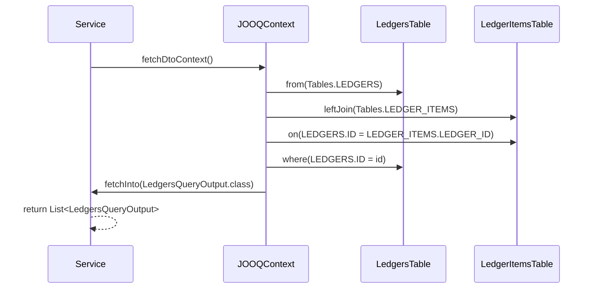
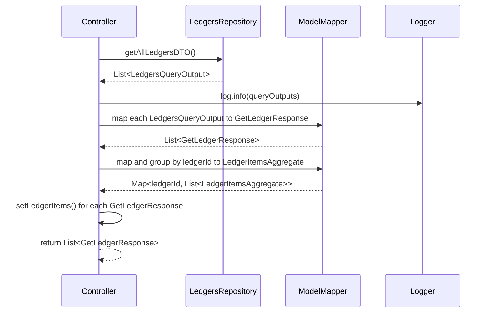

# SpringBoot_CQRS_Query

## Table Of Content
1. [Run Process](#run-process)
2. [Development Process](#development-process)
3. [Design Document](#design-document)
4. [Highlight Functionality](#highlight-functionality)

## Run Process with Docker
```bash
#1 Prepare directory and clone from github
git clone 
cd SpringBoot_CQRS_Query

#2 

#3  Build package and run process with docker
mvn clean package
docker compose up -d --build

```
Check the running project at [port 8184](http://localhost:8184)

## Development Process
see [Main Repository](https://github.com/Thee5176/Accounting_CQRS_Project)

# Highlight Functionality

## Springboot Query Service

| Feature                     | Description                                                                                                    | Reference Link                                                                                                                               |
|-----------------------------|----------------------------------------------------------------------------------------------------------------|---------------------------------------------------------------------------------------------------------------------------------------------|
| Join Table Query with JOOQ  | Tackle N+1 Problem in Repository Layer using JOIN query                                                       | [LedgersRepository.java](https://github.com/Thee5176/springboot_cqrs_query/blob/develop/src/main/java/com/thee5176/ledger_query/Infrastructure/repository/LedgersRepository.java#L57) |
| Flatten Data Extraction     | Tackle N+1 Problem in Service Layer by creating Map of Id to Entity (removes recursive querying)               | [LedgersQueryService.java](https://github.com/Thee5176/SpringBoot_CQRS_Query/blob/develop/src/main/java/com/thee5176/ledger_query/Domain/service/LedgersQueryService.java#L24)       |

### Join Table Query with JOOQ - Sequence Diagram


### Flatten Data Extraction Transaction - Sequence Diagram



## Test Result:
API Test Case:
  ✔ RestAPI Controller
  
